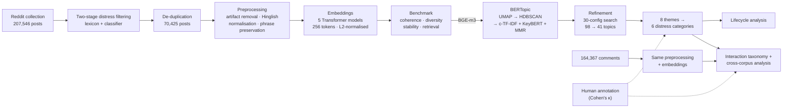
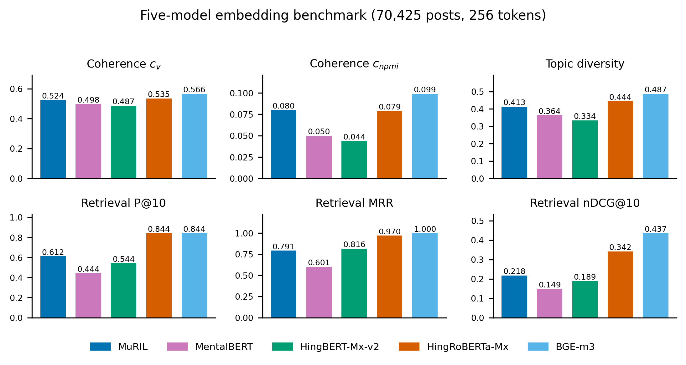
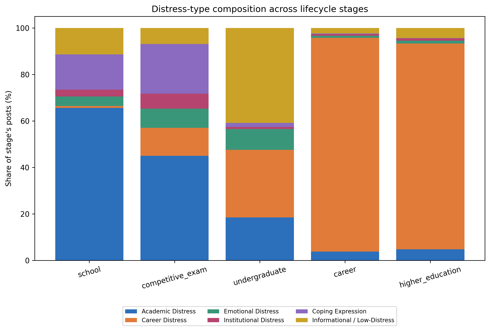
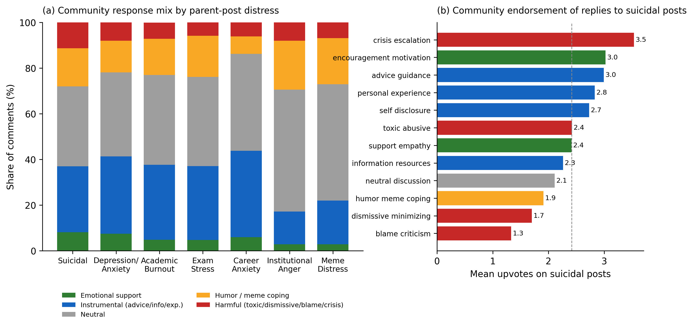

# “Will It Ever Get Better?”: Understanding Psychological Distress Among Indian Students Through Reddit

An NLP pipeline for characterising how psychological distress is expressed — and how it changes — across the
Indian student lifecycle, from school and competitive-exam preparation through college, career, and higher
education. It models **70,425 code-mixed (Hinglish) Reddit posts** and **164,367 linked comments** from 11
student communities using multilingual Transformer embeddings and BERTopic.

> **Paper:** submitted to the IEEE International Conference on Big Data (**IEEE BigData 2026**), Phoenix, Arizona, USA — *under review*.
> Research carried out with the **Data Science for Healthcare Lab, Wright State University**.

---

## Highlights

- **Five embedding models benchmarked** (MuRIL, MentalBERT, HingBERT-Mixed-v2, HingRoBERTa-Mixed, BGE-m3) on topic coherence, diversity, stability, and retrieval. **BGE-m3** was selected — best coherence (c_v 0.566) and retrieval (MAP 0.933, MRR 1.000, nDCG@10 0.437).
- **Topic-model refinement:** a 30-configuration search turned an over-fragmented 98-topic model into a **stable 41-topic model** (c_v 0.652, c_npmi 0.142, diversity 0.720, 0.82% outliers, seed-to-seed ARI 0.97).
- **Taxonomy:** 41 topics → **8 higher-level themes** → **6 distress categories**. Distress is mostly *anticipatory* — Academic (34.4%) and Career (26.8%) — rather than clinical (Emotional 6.9%).
- **Lifecycle shift:** academic distress dominates at the school stage (65.6%), while career distress dominates at the career stage (92.0%); code-mixed coping/meme expression peaks during competitive-exam preparation (21.3%).
- **Community response (comments):** explicit emotional support is scarce, and on suicidal-ideation posts crisis-escalating replies receive *more* up-votes than supportive ones (3.53 vs 2.79, one-sided Mann–Whitney p = 0.0015).

---

## Pipeline



**Engineering notes**
- Embedding generation runs in **10K-document checkpointed chunks** with **length-sorted batching** (less padding) and automatic **MPS / CUDA / CPU** selection, so multi-hour runs resume after interruption without recomputation.
- The hyperparameter search **caches UMAP reductions** and scores every configuration on **count-independent** quality (coherence, stability, keyword distinctiveness, near-duplicate pairs), because centroid-separation metrics were found to be confounded with topic count (r = −0.88).
- Every stage writes frozen intermediate artifacts, so any stage can be re-run in isolation.

---

## Results

### Embedding benchmark (70,425 posts)

| Model | c_v | c_npmi | Diversity | P@10 | MAP | MRR | nDCG@10 |
|---|---:|---:|---:|---:|---:|---:|---:|
| **BGE-m3** | **0.566** | **0.099** | **0.487** | **0.844** | **0.933** | **1.000** | **0.437** |
| HingRoBERTa-Mixed | 0.535 | 0.079 | 0.444 | **0.844** | 0.928 | 0.970 | 0.342 |
| MuRIL | 0.524 | 0.080 | 0.413 | 0.612 | 0.732 | 0.791 | 0.218 |
| MentalBERT | 0.498 | 0.050 | 0.365 | 0.444 | 0.543 | 0.601 | 0.149 |
| HingBERT-Mixed-v2 | 0.487 | 0.044 | 0.334 | 0.544 | 0.721 | 0.816 | 0.189 |

<p align="center"></p>

On the **comment** corpus the ranking changes: **MuRIL** has the best weighted score (0.742; best coherence and stability), while BGE-m3 keeps the best retrieval and diversity — the best embedding model depends on the corpus.

### Topic-model refinement (BGE-m3)

| Metric | 98-topic baseline | **Final 41-topic model** |
|---|---:|---:|
| c_v coherence | 0.626 | **0.652** |
| c_npmi | 0.136 | **0.142** |
| Topic diversity | 0.641 | **0.720** |
| Near-duplicate topic pairs (cos > 0.90) | 280 | **128** |
| Tiny topics (< 200 posts) | 4 | **0** |
| Smallest topic | 149 | **498** |
| Outlier rate | 0.03% | 0.82% |

Final configuration: UMAP (`n_neighbors=50`, `n_components=10`, `min_dist=0.0`, cosine) · HDBSCAN (`min_cluster_size=300`, `min_samples=10`, leaf) · c-TF-IDF + KeyBERTInspired + MMR (0.3) · c-TF-IDF outlier reduction (threshold 0.05). Two-seed stability: **ARI 0.97**.

### Themes and distress taxonomy

| Theme | Posts | % | | Distress category | Posts | % |
|---|---:|---:|---|---|---:|---:|
| Entrance Exam Preparation | 19,136 | 27.4 | | Academic | 24,045 | 34.4 |
| Careers, Placements & Jobs | 11,277 | 16.2 | | Career | 18,722 | 26.8 |
| College & Academic Decisions | 10,376 | 14.9 | | Informational / Low-Distress | 10,689 | 15.3 |
| Coaching & Study Resources | 7,937 | 11.4 | | Coping Expression | 8,850 | 12.7 |
| Higher Studies & Global Mobility | 7,445 | 10.7 | | Emotional | 4,824 | 6.9 |
| Mental Health & Wellbeing | 4,824 | 6.9 | | Institutional | 2,715 | 3.9 |
| General Venting | 4,770 | 6.8 | | | | |
| Coping & Meme Culture | 4,080 | 5.8 | | | | |

### Distress across the lifecycle

<p align="center"></p>

| Stage | Dominant distress |
|---|---|
| School | Academic 65.6% |
| Competitive examination | Academic 45.0% · Coping/meme 21.3% |
| Undergraduate | Informational 40.9% · Career 29.1% |
| Career | Career 92.0% |
| Higher education | Career 88.6% |

### Community response (138,989 cleaned comments)

<p align="center"></p>

- Replies are mostly neutral discussion (43.7%), advice (17.5%) and humour/meme-coping (17.3%); the **emotional-support-to-harm ratio is 0.67 : 1**.
- Suicidal-ideation posts attract the **most engagement** (22.8 comments per post), yet **50.1%** of them receive no explicitly supportive reply and crisis-escalating replies are **3.83×** more frequent than the corpus baseline.
- Parent-post distress and response type are associated (χ² = 9,281, df = 66, p < 0.001; Cramér's V = 0.105).

### Validation

| Task | Samples | Agreement (95% bootstrap CI) | Cohen's κ |
|---|---:|---|---:|
| Post distress labels | 300 | 70.0% (0.643–0.747) | ≈ 0.00 |
| Comment interaction labels | 300 | 17.7% (0.133–0.217) | 0.10 |

The distress sample is dominated by one class (210/300), so raw agreement is high but κ is near zero; the interaction labels come from a keyword-based classifier. Both are therefore reported as **descriptive** labels rather than validated classifiers.

---

## Repository structure

```
.
├── README.md
├── requirements.txt
├── paper/                    # manuscript (added after review)
├── data/                     # NOT tracked — see data/README.md for the expected layout
├── src/
│   ├── preprocessing/        # artifact removal, Hinglish normalisation, phrase preservation
│   ├── pipeline/             # BERTopic search / finalisation, paper figures & tables
│   └── analysis/             # comment-corpus BERTopic, coherence, retrieval, stability, taxonomy
├── scripts/
│   ├── posts/                # post embeddings, benchmark, retrieval, benchmark figures
│   ├── comments/             # comment preprocessing, embeddings, analysis, statistics
│   ├── annotation/           # annotation sampling and agreement
│   └── figures/              # revised paper figures
└── final_outputs/            # metrics, reports, tables and figures (see final_outputs/README.md)
```

---

## Setup

```bash
git clone <repo-url>
cd <repo-folder>
python -m venv .venv
source .venv/bin/activate
pip install -r requirements.txt
```

Tested with Python 3.13 on Apple Silicon (MPS); CUDA and CPU are selected automatically. Models are downloaded from Hugging Face on first use into `model_cache/`.

## Reproducing the results

All commands run from the repository root and expect the data layout in [`data/README.md`](data/README.md). Embedding generation takes several hours per corpus; the runners checkpoint and can simply be re-run after an interruption.

**Posts**

```bash
bash scripts/posts/run_all_posts_embeddings_256.sh            # 5 models, 256 tokens

for m in MuRIL:muril MentalBERT:mentalbert HingBERT-Mixed-v2:hingbert_mixed_v2 \
         HingRoBERTa-Mixed:hingroberta_mixed BGE-m3:bge_m3; do
  python scripts/posts/run_posts_bertopic.py --model-name "${m%%:*}" \
         --embedding-path "data/embeddings/posts/${m##*:}_embeddings.npy"
  python scripts/posts/run_posts_coherence.py --model "${m%%:*}"
done
python scripts/posts/run_posts_retrieval.py                    # 25-query retrieval benchmark
python scripts/posts/generate_posts_figures.py

python src/pipeline/bertopic_search.py                         # 30-config search (BGE-m3)
python src/pipeline/bertopic_finalize.py                       # final 41-topic model
python src/pipeline/paper_assets.py                            # figures, taxonomy, metadata
python src/pipeline/paper_extras.py
python src/pipeline/paper_tables.py
```

`src/pipeline/bertopic_refinement.py` is an optional stop-word / artifact audit (`--phase audit`) used while refining the topic model.

**Comments**

```bash
python scripts/comments/preprocess_comments.py                 # 164,367 -> 138,989 comments
bash scripts/comments/run_comments_embeddings_256.sh           # 5 models, 256 tokens
bash scripts/comments/run_comments_analysis.sh                 # BERTopic, coherence, retrieval, stability, aggregate
python src/analysis/comments_taxonomy_v2.py                    # interaction taxonomy
python scripts/comments/cross_corpus_analysis.py               # response vs. parent-post distress
python scripts/comments/suicidal_interaction_stats.py          # chi-square, Cramér's V, Mann-Whitney
```

**Figures and validation**

```bash
python scripts/figures/make_revised_figures.py
python scripts/figures/make_theme_fig.py
python scripts/figures/make_cross_corpus_fig.py
python scripts/annotation/annotation_agreement.py
```

---

## Data and ethics

The corpus consists of public Reddit content that includes usernames and sensitive first-person disclosures. To protect the people who wrote it, **no raw text, post/comment IDs, or per-document labels are published** — only aggregate results. The work is a descriptive, cross-sectional study; it is not a diagnostic tool and does not attempt to identify individuals.

## Limitations

- Reddit users are not representative of all Indian students.
- Mostly English and Hinglish; other Indian languages are not modelled.
- Cross-sectional: no causal or longitudinal claims.
- Human validation is limited (see *Validation*); topic, theme and retrieval validation were not human-annotated.

## Authors

| Author | Affiliation |
|---|---|
| Chinmaya Krishna B | School of Computer Engineering, Manipal Institute of Technology, Manipal, India |
| Animesh Kumar | School of Electrical Engineering, Manipal Institute of Technology, Manipal, India |
| Piyush Kumar | School of Basic Sciences, Humanities and Management, Manipal Institute of Technology, Manipal, India |
| Misty M | School of Electrical Engineering, Manipal Institute of Technology, Manipal, India |
| Tanvi Banerjee | Data Science for Healthcare Lab, Wright State University, Dayton, USA |
| William Romine | Data Science for Healthcare Lab, Wright State University, Dayton, USA |
| Ramakrishna Mundugar | School of Computer Engineering, Manipal Institute of Technology, Manipal, India |

## Citation

The paper is under review; please cite it as below until a published version is available.

```bibtex
@unpublished{krishnab2026willitevergetbetter,
  title  = {``Will It Ever Get Better?'': Understanding Psychological Distress Among Indian Students Through Reddit},
  author = {{Chinmaya Krishna B} and {Animesh Kumar} and {Piyush Kumar} and {Misty M} and
            {Tanvi Banerjee} and {William Romine} and {Ramakrishna Mundugar}},
  note   = {Submitted to the IEEE International Conference on Big Data (IEEE BigData 2026)},
  year   = {2026}
}
```
